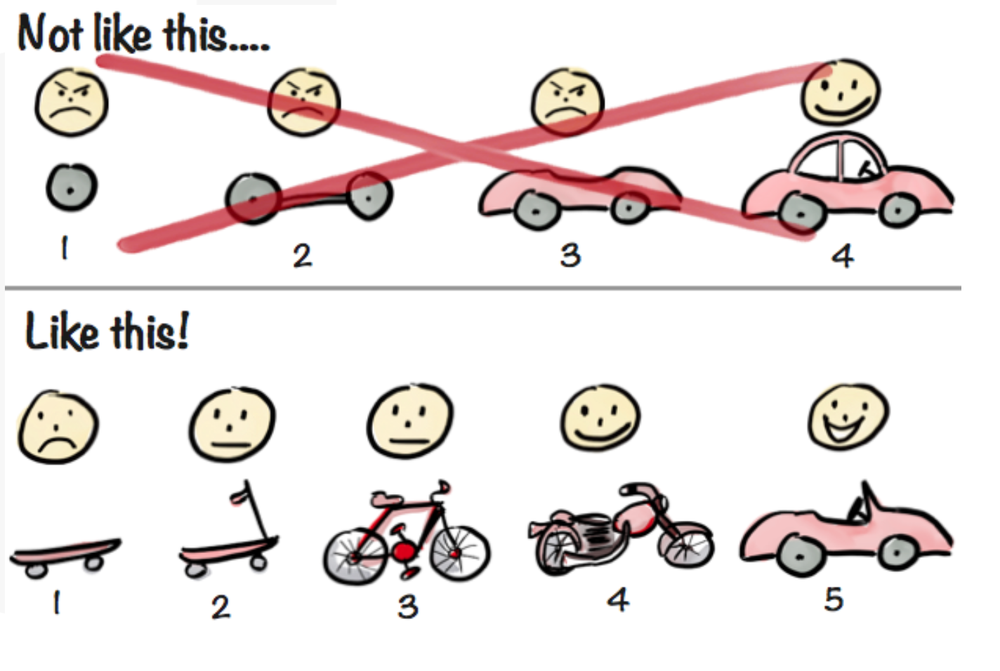
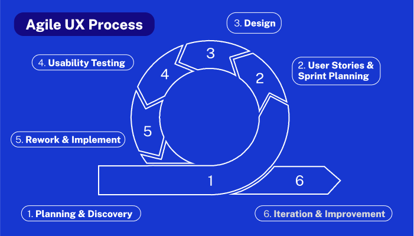
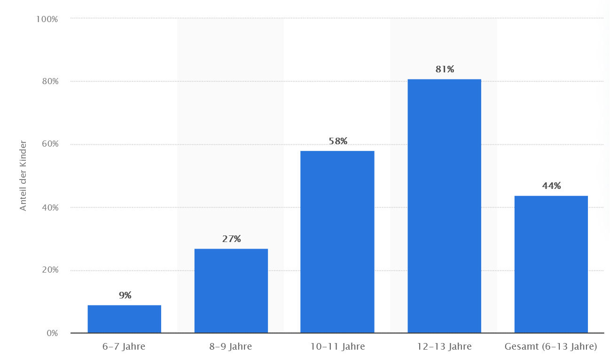
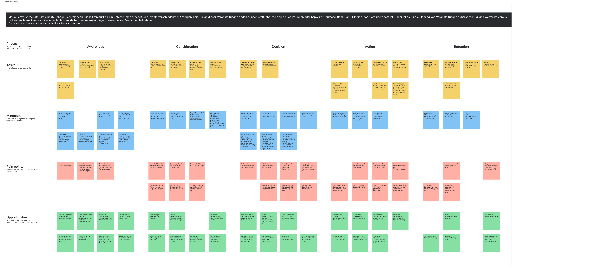

## **Agiles Framework**
Als Auswahl stehen viele verschiedene Vorgehensmodelle, die die Arbeit am Projekt eines Teams auf verschiedene Art und Weise leiten. In der Vorlesung am 26.10.2023 wurden einige Frameworks detailierter analysiert. Das waren:
- Double Diamond
- Lean UX
- Agile UX
- Design Sprint

Jedes dieser Frameworks hat natürlich seine Vor- und Nachteile. Letztendlich hat sich die Gruppe für ein Framework entschieden.
### Warum Agile UX?
Agile UX ist ein relativ neues Vorgehensmodell, wie ein Team an einem Projekt arbeitet.
Es hat 5 Kernprinzipien:
1. **Inkrementelle Entwicklung und "bite-sized"Lieferung**
Wie alle agilen Vorgehensmodelle ist die Idee bei AgileUX das Produkt nicht mit einem "Big-Bangäm Ende der Vorgegebenen Zeit vollständig zu liefern, sondern Iterativ in kleinen Schritten. Ziel dabei ist es immer 
ein MVP(**M**inimal **V**iable **P**roduct) zu liefern.

2. **Flexibiltät und Adaptivität**
Designer und Entwickler müssen auf sich ändernde Anforderungen anpassen können. Deshalb wird das Vorgehen auch "agil" genannt.

3. **Kollaboration und Kommunikation**
Es ist ständig Kommunikation gefördert, nicht nur unter den Entwicklern, sondern auch mit Stakeholdern und Nutzern

4. **Eingespieltes Team**
Die Entwickler müssen zusammen in den Sprints als Teams arbeiten. Die Teams müssen kreativ, schnell und anderen Teammitgliedern rechenschaftspflichtig sein.

5. **Nutzer-Feedback**
Das UX in Agile UX steht für "User Experience". Das heißt, dass der Kunde in den Entwicklungsprozess mehr eingebunden wird. Dieser kann kontinuierlich Feedback geben bezüglich des Zwischenstands des Projekts. Dadurch stellt man sicher, dass der Kunde das bekommt, was er erwartet und die Entwickler wissen besser, was von Ihnen erwartet wird.

### Gründe für Agile UX
Agile UX bietet sich für unser Projekt wegen der schnellen Iterationen. Die empfohlene Sprint-Dauer von 2 Wochen passt gut in den Praktikumszyklus. Das regelmäßige Abholen vom Kundenfeedback ist in einem solchen Projekt, wo man viel an der UI arbeitet, sehr weiterhelfend. Dass sich ein Kunde sich nicht mit dem Code beschäftigt, sondern eher mit der UI, kriegt man auch hauptsächlich Feedback zur UI. Agile UX ist ein kompliziertes Vorgehensmodell, weshalb es im Unternehmen bis jetzt nicht oft verwendet wird. Wir arbeiten jedoch in einer kleinen Gruppe von 4 und können uns daher effizient miteinander kommunizieren und koordinieren. Wir erwarten, dass es sehr schwer sein wird, die Agile UX straffen Zeitpläne einzuhalten. Wir derden es aber bestmöglich versuchen einzuhalten :)

## **User Research**
### Was ist das Ziel unseres User Research?
Mit Google und Apple haben wir eine namenhafte Konkurrenz, was Wetter-Apps angeht. Unsere App soll also die Probleme beheben, welche die bestehenden Apps haben und Features hinzufügen, welche die bestehenden Apps nicht haben. Die Interviews sollen also dazu dienen, diese Schwachstellen zu identifizieren und diese in unserem Programm zu lösen. Im 'User Research' wollen wir also die frustrierenden als auch die guten Aspekte der bestehenden Apps herausfinden und dokumentieren.   
Die WeatherFox-App soll so sich von der anderen Apps absetzen.

### User Stories
- Als Nutzer möchte ich möglichst ohne weitere Klicks alle relevanten Informationen zum Wetter sehen können
- Als Nutzer möchte ich nur für mich nützliche Informationen sehen
- Als Nutzer möchte ich direkt wissen, ob die angezeigte Information zum aktuellen Zeitpunkt und Ort gehört oder nicht
- Als Nutzer möchte ich Wetterinformationen zu anderen Standorten sehen können, ohne meine Einstellungen zu meinem Standort zu löschen 
- Als Pendler möchte ich die Wetterinformationen zu beiden Standorten schnell bekommen können

### Hypothesen

**Hypothese 1:**
Erfahrungen wie plötzlicher Regen, unzureichende frühzeitige Warnungen oder Probleme mit der Kleiderwahl könnten als Delighter-Faktoren dienen, die die Zufriedenheit mit einer Wetter-App steigern könnten, wenn diese Probleme durch die App gelöst werden können. 
**Hypothese 2:**
Die Häufigkeit der Nutzung von Wetter-Apps variiert je nach den individuellen Bedürfnissen. Personen, die täglich im Freien arbeiten oder Outdoor-Aktivitäten unternehmen, neigen dazu, die App häufiger zu nutzen 
**Hypothese 3:**
Einige Nutzer könnten mehrere Wetter-Apps verwenden, um unterschiedliche Metriken abzudecken, während andere eine All-in-One-Lösung bevorzugen 
**Hypothese 4:**
Nutzer frustriert es, durch viele Metriken scrollen zu müssen, um die metrik zu bekommen, welche sie brauchen.  
**Hypothese 5:**
Die Funktion ein benutzerdefiniertes Profil zu erstellen bzw Metriken selber an- und auszustellen hilft bei der Übersicht und Benutzerfreundlichkeit der App. 

### Welche fragen sollen geklärt werden?
Folgende Fragen wollen wir im 'User Research' klären:
- Was finden Nutzer besonders gut an ihrer Wetter-Apps
- Wie oft werden Wetter-Apps verwendet
- Wie werden die Apps benutzt
- Wofür werden die Apps benutzt
- Was ist besonders wichtig an der App
- Was sind die Nachteile der App
- Was stört Nutzer besonders an ihren Wetter-Apps
- Welche Features fehlen in Wetter-Apps

### Aufbau der Interviews:

Die Fragen sind in zwei Kategorien aufgeteilt. In Hauptfragen, und die daraus ableitenden Unterfragen. Das Interview soll nicht statisch nach einem Protokoll ablaufen. Daher gibt es die Hauptfragen, die gestellt werden. Die Unterfragen versucht man dann nach Möglichkeit in das Interview passend zu integrieren.

- Machen Sie irgendwelche Outdoor-Aktivitäten in Ihrer Freizeit?
  - wenn ja: 
    - Ist man da irgendwie vom Wetter abhängig?
    - Sind da bestimmte 'ungewöhnliche' Metriken wichtig?
    - Deckt Ihre Wetter-App alle Metriken ab?
    - Benötigen Sie mehrere Wetter-Apps?

Diese Fragen sind dazu da, um den Befragten darauf aufmerksam zu machen, ob er alle Features die er braucht auch in seiner App hat. Bei einigen Menschen hat es sich bereits standardisiert, dass sie ehrere Apps für das Wetter nutzen 
  - wenn nein:
    - Ist beim Hin-/ und Rückweg zur Arbeit/Uni das Wetter wichtig?
    - Wie/Mit welchem Transportmittel kommen Sie zur Arbeit/Uni?
- Schauen Sie sich Wetter-Vorhersagen an?
  - Wie oft tun Sie das?
  - Welche Seite bzw. welche App nutzen Sie dafür?
- Was gefällt Ihnen an der App besonders?
  - Kann daran sich noch etwas verbessern?
  - Warum verwenden Sie diese Wetter-App?

Ziel hiervon ist es, funktionale Anforderungen zu bekommen, was Nutzer unbedingt in der App brauchen.
- Gibt es etwas was Sie an Ihrer Wetter App stört?
  - Fehlende Metriken?
  - Verstehen Sie alles, was angezeigt wird?
  - Sind die Informationen einfach erreichbar?
  - Kann man einstellen, was für Daten angezeigt werden sollen?

Hier wird keine wirkliche Antwort erwartet. Die bereits existierenden Apps sind bereits gut. Sollte dennoch jemand kritikpunkte finden, werden diese als Anforderungen in die App mitaufganommen.
- Gibt es etwas was Ihnen an der App fehlt?
  - fehlende Features?
- [Fragen zum Delighter]
  - Gab es mal Fälle, wann man unerwartet vom Regen erwischt wurde?
  - Ist man frühzeitig/rechtzeitig über Wetterlage informiert?
  - Hatte man Probleme, unpassend zum Wetter angezogen zu sein?

Hiermit wird erwartet, eine Meinung zu unserer Idee zu bekommen, ob das etwas ist, was der Befragte nutzen würde oder ob er/sie allgemein die Idee gut finden.

### Durchführung der Interviews:

F: Bist du zufrieden mit deiner Wetter App? 
A1: Ja, ich bin zufrieden.  
A2: Ja, ich bin zufrieden mit meiner Wetter-App. Sie hilft mir sehr bei der Planung von Veranstaltungen.

F: Findest du die Wetter-App übersichtlich? 
A1: Ja finde ich. 
A2: Ja, die Wetter-App ist übersichtlich und leicht zu verstehen.

F: Welche Metriken sind dir wichtig? 
A1: Regenwahrscheinlichkeit, Sonnenaufgang und Sonnenuntergang, eine stündliche Bilanz und eine Karte für den Verlaufs des Wetters und dem Vergleich zwischen Ländern. 
A2: Die wichtigsten Metriken für mich sind Temperatur, Niederschlagswahrscheinlichkeit und Windgeschwindigkeit.

F: Sagt dir der Prozentsatz des Regens etwas? 
A1: Ja es sagt aus, wie viel Prozent der Ortschaft betroffen ist vom Regen 
A2: Ja, der Prozentsatz Regen ist eine entscheidende Metrik für meine Arbeit.

F: Gibt es Metriken, die dir nicht wichtig sind? 
A1: Luftfeuchtigkeit und Luftdruck nicht so wichtig 
A2: Nicht wirklich, alle Metriken sind relevant, besonders bei Outdoor-Veranstaltungen.

F: Sagt dir die gefühlte Temperatur etwas? 
A1: Ja, meines Wissens ist es die tatsächliche Temperatur beeinflusst durch Luftfeuchtigkeit etc. 
A2: Ja, die gefühlte Temperatur ist wichtig, da sie den tatsächlichen Einfluss des Wetters auf die Menschen besser widerspiegelt.

F: Sind, deiner Meinung nach, die Daten genau? 
A1: Es geht. Ich denke die sind eher auf den Umkreis bezogen 
A2: Im Großen und Ganzen ja, aber es gab schon Situationen, in denen die Prognose nicht ganz präzise war.

F: Was findest du besonders cool an der App? 
A1: Animationen in der App sind cool 
A2: Besonders cool finde ich die Echtzeitaktualisierungen und die präzisen Warnungen vor extremen Wetterbedingungen.

F: Warst du mal unvorbereitet auf Regen, am Abend zum Beispiel? 
A1: Eher nicht. Die Vorhersagen sind relativ präzise. Meistens hat es dann nur genieselt.  
A2: Ja, es gab schon Situationen, in denen ich unvorbereitet auf Regen war, aber die App hat mir geholfen, flexibel zu reagieren.

F: Guckst du morgens in die App? 
A1: Nein nicht so oft. 
A2: Ja, ich schaue morgens oft in die App, um den Tag zu planen und mich auf mögliche Wetteränderungen vorzubereiten.

F: Also kam es doch bestimmt mal dazu, dass das Wetter einen unerwarteten Verlauf genommen hat oder? 
A1: Ich erinnere mich an den Frühling. Da wurde es am Nachmittag öfter heiß, sodass ich keinen Pulli mehr gebraucht habe. 
A2: Ja, es kam schon vor, dass das Wetter einen unerwarteten Verlauf genommen hat, aber die App ermöglicht mir, schnell darauf zu reagieren.

F: Was hältst du von der Idee einen Kalender in einer Wetter-App zu implementieren, sodass vor dem Verlassen des Hauses oder vor wichtigen Terminen bezüglich des Wetters benachrichtigt wird? Also, dass zum Beispiel am Abend regnen könnte und man daher am Morgen einen Regenschirm mitnehmen sollte.  
A1: Ich finde die Idee gut. So wäre man definitiv etwas vorbereiteter auf das Wetter.

F: Würdest du dir eine Funktion wünschen, mit der du einstellen könntest, welche Daten dir angezeigt werden und welche nicht?  
A1: An sich bin ich mit der Ansicht meiner aktuellen Wetter-App zufrieden. Aber selber Daten zu verschieben oder vom Screen zu löschen, wäre bestimmt cool. 

F: Wie lange benutzt du IPhone bzw. die Wetter App? 
A1: 6-7 Jahre.  
A2: Ich benutze mein iPhone und die Wetter-App seit ungefähr fünf Jahren.

F: Gab es Änderungen in der Zeit? 
A1: Ja es gab einige Änderungen in der App im Laufe der Zeit. Das Layout hat sich geändert und neue Metriken wurden hinzugefügt. 
A2: Der Internetverbrauch der Wetter-App ist im Allgemeinen gering, da sie nur periodisch aktualisiert wird.

F: Wie oft nutzt du die App? 
A1: Täglich, weil es im Widget zu sehen ist. 
A2: Ich nutze die App täglich, besonders wenn ich Events plane.

F: Wie hoch ist der Internetverbrauch der Wetter App? 
A1: 4 MB. 
A2: Der Internetverbrauch der Wetter-App ist im Allgemeinen gering, da sie nur periodisch aktualisiert wird.

### Bewertung der Hypothesen
**Hypothese 1:**  
Die Interviews ergaben, dass ein unerwarter Wetterverlauf auf jeden Fall schon mal vorkam. Ein rechtzeitiges Warnen oder Hinweis bezüglich der Kleidungswahl würde in so einem Fall definitv hilfreich sein.  
Unsere Hypothese trifft zu. ✅

**Hypothese 2:**  
Wetter-Apps werden in der Regel täglich genutzt. Je nach Nutzer-Typ, vor allem die, die Outdoor-Aktivitäten planen, auch öfter am Tag.  
Unsere Hypothese trifft zu. ✅

**Hypothese 3:**  
Die von uns befragten Nutzer, sind mit ihrer Wetter-App relativ zufrieden, weshalb sie nicht zwingend in andere Apps schauen müssen.  
Unsere Hypothese trifft nicht zwingend zu. 🟡

**Hypothese 4:**  
Weil die Befragten mit der Übersichtlichkeit ihrer App zufrieden sind und auf die wertvollen Daten zugreifen, können wir sagen:  
Unsere Hypothese trifft nicht zu. 🔴

**Hypothese 5:**  
Ein editierbarer Screen mit an- und ausstellbaren Metriken ist definitiv erwünscht.  
Unsere Hypothese trifft zu. ✅

### Benutzer und Kriterien definieren
Wie bereits in dem Kapitel "Projektvision" erwähnt, planen wir eine App "für alle" zu designen. Daher müssen wir die verschiedensten Kundengruppen betrachten und analysieren. Jeder, der ein Handy hat, hat auch eine Wetter-App installiert. In Deutschland sind es 67,6 Millionen Menschen. Damit sind es 81,25% der Bevölkerung, die potentielle Nutzer unserer App sind. Hauptsächlich sind es aber Menschen, die viel Zeit draußen verbringen (müssen) wie Landwirte, Outdoor-Sportler, Pendler, Fahrer usw.
Nutzer aus den verschiedensten Altersgruppen, unterschiedlichsten Ausbildungen und Erfahrung sind zu betrachten.

Es sollten folgende Kriterien bei den Nutzern in Betracht genommen werden:
- Alter (etwa 16-65)
- Bildung (Grundschule - Abschluss)
- Beruf (z.B.: Landwirt, Eventplaner, Reisende ...)
- Zeit am Handy
- Zeit draußen
- Wissen über Metriken (z.B. was ein Tiefdruckgebiet ist)
- Freizeitaktivitäten
- Abhängigkeit vom Wetter (Fehlertoleranz)
- Ziele bei Nutzung der App

Daraus lassen sich mehrere Nutzergruppen ableiten:
- Standardnutzer: Die mit Abstand größte Nutzergruppe. Diese Nutzer schauen 1-2 Male pro Tag in eine Wetter-App um zu prüfen, ob man Regensachen mitnehmen muss oder eben nicht. Dies ist die Zielgruppe der App, da durch die Kalenderfunktion ein Blick in die App gespart wird, was das erlangen von Wetterinformationen vereinfacht. 
- Intensivnutzer: Menschen, welche mehr Metriken brauchen als ein durchschnittlicher Mensch. Zwar nutzen sie die App genauso häufig wie ein Standardnutzer, dennoch tun sie das deutlich 'Intensiver'.
- Vielnutzer: Menschen, die bspw. beruflich stark vom Wetter abhängen und häufige Wetter-Updates brauchen.    
### Personas
Um verschiedene Blickwinkel auf die App zu haben, haben wir folgende fiktive Personas erstellt, die potentielle Nutzer der App sein werden:

**Persona 1**

Luca Becker (ledig) ist ein 24-jähriger BWL-Student an der Universität Mannheim. Während der Woche pendelt er mit dem Bus zwischen seiner WG und dem Campus. Er legt Wert darauf, zu wissen, ob es regnen wird oder nicht, da er sonst nass werden könnte. An Werktagen sind ihm die restlichen Wettermetriken ziemlich egal, da er jeden Tag dasselbe trägt.

Am Wochenende fährt Luca oft mit seinen Kommilitonen zum Surfen nach Biblis. Da es ein weiter Weg dorthin ist, ist es ihm wichtig, zu wissen, ob das Wetter zum Surfen geeignet ist. Er möchte nicht umsonst einen halben Tag für die Hinfahrt verschwenden. Daher ist es ihm wichtig, dass die Wetter-App ihm mitteilt, ob das Wetter an dem Ort, wo er hin will, gut ist zum Surfen. Außerdem ist ihm auch wichtig, was für ein Wind im Surfpark weht, um zu wissen, ob er sein Windsurfboard mitnehmen soll oder nicht. 
Er gehört eher zu einerm Standardnutzer, ist jedoch an Wochenenden ein Intensivnutzer.

**Persona 2**

Maria Perez (verheiratet) ist eine 32-jährige Eventplanerin, die in Frankfurt bei einem Unternehmen arbeitet, das Events verschiedenster Art organisiert. Einige dieser Veranstaltungen finden drinnen statt, aber viele sind auch im Freien oder bspw. im 'Deutsche-Bank-Park'-Stadion, das nicht überdacht ist. Daher ist es für die Planung von Veranstaltungen äußerst wichtig, das Wetter im Voraus zu kennen. Maria kann sich keine Fehler leisten, da bei den Veranstaltungen Tausende von Menschen teilnehmen. Ein Fehler bei der Planung hätte fatale Folgen. Das Wetter ist einer der wichtigsten Faktoren bei der Planung von Veranstaltungen, da es oft der alleinige Faktor ist, ob die Veranstaltung drinnen oder draußen stattfinden kann.  
Sie ist eine Vielnutzerin. Die Planung von Events benötigt bis zum letzten Moment eine möglichst genaue Wettervorhersage mit möglichst vielen Wettermetriken.  

**Persona 3**

Antonio Rossi (verheiratet) ist ein 56-jähriger Winzer, der seit über 30 Jahren ein Weinfeld in Rüdesheim betreibt. Um die höchste Weinqualität zu gewährleisten, muss er genau auf die Wetterumstände achten. Er nutzt dazu neben der vorinstallierten Wetter-App auf seinem Handy zwei weitere Apps, um an alle ihm wichtigen Informationen ranzukommen.

Die Wetterbedingungen, auf die er achten muss, umfassen Faktoren wie Niederschlag in mm, die Zeit, wie lange die Sonne scheint, unter welchem Winkel die Sonne scheint usw. Diese Metriken entscheiden, wie stark die Felder bewässert werden müssen oder ob er die Felder mit einer Schutzfolie zudecken muss.

Er ist ein Intensivnutzer. Er hat einige Metriken, welche er mehr als ein durchschnittlicher Nutzer braucht. Jedoch braucht er diese nicht besonders häufig. Ein täglicher Blick in die App reicht aus.

### Datenanalyze

Grundsätzliche Analyse der Interviewprotokolle und Identifizierung der wiederkehrenden Themen, Schwachstellen und positiven Erfahrungen. Extrahierung der Erkenntnisse zu Benutzerpräferenzen und Erwartungen an eine Wetter-App.

### Customer Journey Map

### Fazit
Nach dem Führen der Interviews und Erstellen der Customer Journey Map sind wir als Team zu folgendem Entschluss gekommen. Einem Wetter-App-Nutzer sind zwei Dinge besonders wichtig. Die Übersichtlichkeit, also nur mit den wichtigsten Informationen versorgt zu werden. Und die Zuverlässigkeit der Daten. Denn anhand des Wetters richtet man seinen Alltag. Sowohl der Kleidungsstil als auch das Planen von Aktivitäten oder Veranstaltungen wird beeinflusst. Um im Alltag also eine Hilfe zu sein, möchten wir unseren Fokus darauf legen, vor allem die Startseite, so minimalistisch wie möglich zu gestalten. Das heißt nur die wichtigsten bzw. vom Nutzer gewünschten Daten anzeigen zu lassen. Durch das Integrieren eines Kalenders (unser Delighter) wird es uns außerdem möglich sein hilfreiche Tipps mitzugeben. So können wir, über Eintragungen im Kalender, nachvollziehen was für Termine anstehen und beim Verlassen des Hauses am Morgen dazu raten einen Regenschirm mitzunehmen, wenn es am Abend regnen sollte. Oder bei einem starken Temperaturanstieg gegen Mittag, am Morgen ein Oberteil anzuziehen was man einfach ausziehen könnte. Mit diesen Umsetzungen hoffen, wir die Benutzerfreundlichkeit und Übersicht unserer App zu garantieren und den Nutzer im Alltag hilfreich zu begleiten.