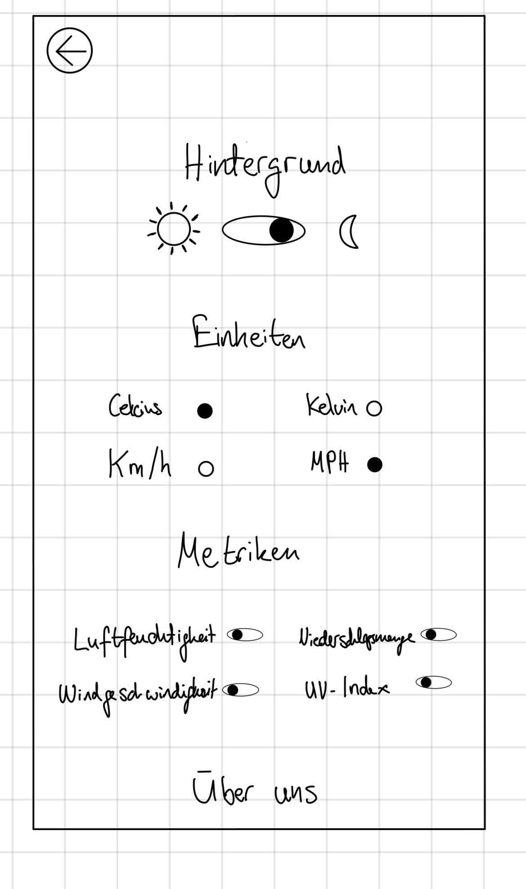

# Design
# Paper Prototype 1

# Paper Prototype 2

# Colors
		
Da unsere App WeatherFox heißt, haben wir uns auf Orange Farbe als Secondary Color geeignet (Der Fuchs wird mit der Orange Farbe assoziiert). 
Als Wetterhervorsage App wäre dazu auch sinnvoll Primary Color als Hellblau bzw. Blau zu definieren (Himmel Farbe).

- `#4a86e8ff` –  Light Primary Color
    - `#0588d3` –  Dark Primary Color 
- `#eb8a00` –  Dark Secondary Color
    - `#ffb54b` – Light Secondary Color

# Font
Wir haben uns aus folgenden Gründen für Font Roboto [Roboto](https://fonts.google.com/specimen/Roboto) entschieden:

- Lesbarkeit: Roboto wurde entwickelt, um auf kleinen Bildschirmen gut lesbar zu sein. Die klaren Linien und gut definierten Buchstaben machen es einfach, den Text auf Mobilgeräten zu erkennen und zu lesen.

- Vielseitigkeit: Roboto ist eine vielseitige Schriftart, die gut für verschiedene Anwendungsfälle geeignet ist, von Überschriften bis zu Fließtext.

- Unterstützung durch Android  
 

Als Fallback Fonts: Arial, Helvetica
 
 

# Logo Design

Als Tool haben wir bei der Erstellung GPT4 verwendet.

# Figma Mockup

# Navigation diagram 

# Riverpod Architektur

Was die Architektur unserer App angeht, haben wir uns für Riverpod aus folgenden Gründen entschieden:

**Einfache Integration:**

Riverpod lässt sich leicht in Flutter-Anwendungen integrieren, ohne umfangreiche Konfigurationen.
Reaktive Programmierung:
Riverpod basiert auf dem Prinzip der reaktiven Programmierung, was bedeutet, dass Benutzerschnittstellen automatisch aktualisiert werden, wenn sich Daten ändern.

**Zustandsmanagement:**

Riverpod bietet effektives Zustandsmanagement, was in Flutter wichtig ist, um den Zustand der Anwendung zu verwalten und zu aktualisieren.

**Modularität:**

Die Verwendung von Providern in Riverpod ermöglicht eine modulare Strukturierung des Codes, was die Wartbarkeit und Erweiterbarkeit der Anwendung verbessert.

**Testbarkeit:**

Riverpod erleichtert das Testen von Flutter-Anwendungen, da es die Trennung von Geschäftslogik und Benutzeroberfläche unterstützt.

**Unabhängigkeit von der UI:**

Riverpod erlaubt es, die Geschäftslogik von der Benutzeroberfläche zu entkoppeln, was zu einer sauberen und gut strukturierten Codebasis führt.

**Community-Support:**

Riverpod wird von einer aktiven Community unterstützt, was bedeutet, dass es regelmäßig aktualisiert wird und auf Probleme oder Anfragen schnell reagiert wird.

